# Trabalho-Pratico-Git
Trabalho final prático de GIT

# Indice
- [Objetivos](#Objetivos)
- [Grilo](#Grilo)
- [Abreu](#Abreu)

# Objetivos
Operações essenciais do Git/GitHub:

- Clone
- Branch
- Commit
- Merge
- Rebase
- Cherry-pick
- Tags
- Pulls
- Pull requests
- Resolução de conflitos

## Grilo

Incialmente Configurei o token para o projeto.
Depois adicionei as pastas principais do projeto e fiz commit para o github para a branch "main".

Criei a branch "Grilo" onde irei fazer as minhas alterações.

### Merge

Começei por criar um script chamado  "script_grilo.py" que é um script para calcular a area de um triangulo.

Depois fiz git commit de todas as alterações e irei realizar o git merge para juntar a branch "Grilo" para o "main".
De seguida fiz o push para o github para a branch "main" 

### Rebase
Entrei na branch Grilo fiz as alterações ao README.md.

Primeiro fiz um commit onde alterei o README.md, depois voltei a branch main e fiz o rebase.
Basicamente o rebase server para fazer com que os commits "pareçam que venham da branch main" e não da branch Grilo

### Cherry-pick e Tags

Primeiro fiz um commit onde alterei o README.md e depois fiz outro commit onde corrigi o bug do "script_grilo.py"

Adicionei tambem uma tag ao commit onde corri o bug onde meti "tag 1.0"

Depois voltei para a branch main e fiz cherry-pick apenas do commit "Bug fix in script_grilo.py" 

## Abreu

Inicialmente criei um script em python em que o erro se situa na linha 6 em que o numero2 está registado como 0, sendo impossivel a divisão.

De seguida criei uma branch, nomeadamente "branch_abreu" onde vou começar a trabalhar.

Dei git merge para juntar a branch "abreu_branch" para o main".

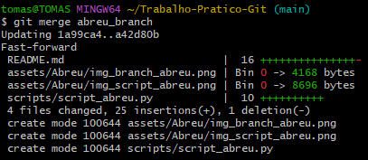

Corrigi o script 

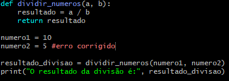

Vou criar este texto de modo a mudar o conteúdo do ficheiro e fazer o primeiro commit para dar inicio ao cherry pick

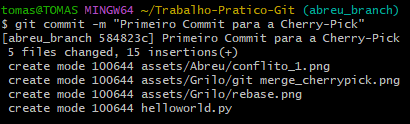

Śegundo commit

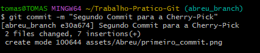

De seguida tive um erro em que tive que mudar para a branch "main" para fazer o cherry-pick

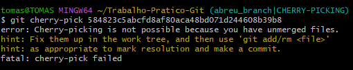

Mudei então para a main

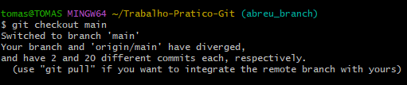

E fiz a cherry-pick

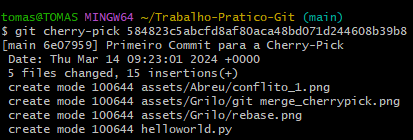

Fiz git status

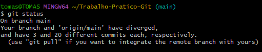

Git rebase

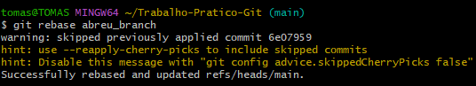

Dei push para o Git Hub

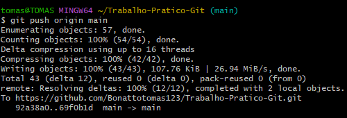

Dei push para enviar as informações para o nosso github.

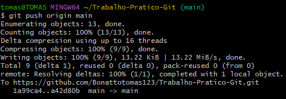

E enviei as informações de novo a partir do comando git push.

## Antunes

Inicialmente comecei por fazer GIT Clone, onde de seguida dei fork no Github. Daqui criei o meu repositório onde introduzi um script com erros "script_antunes"

De seguida corrigi o script "script_antunes", adicionei o script, seguido de um commit e de um rebase

Agora vou fazer um cherry-pick, para isto editei o script_antunes duas vezes onde dei dois commits, o "first" e o "second"

Efetuei agora o cherry-pick onde vou tentar puxar o primeiro "first"

De seguida adicionei tags, e dei push às mesmas

Para finalizar corrigi um conflito que me apareceu neste processo

