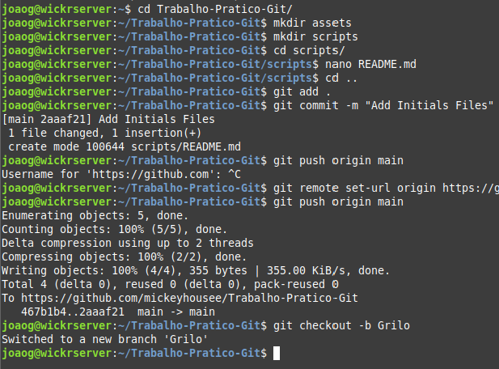
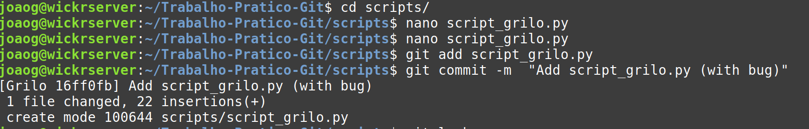
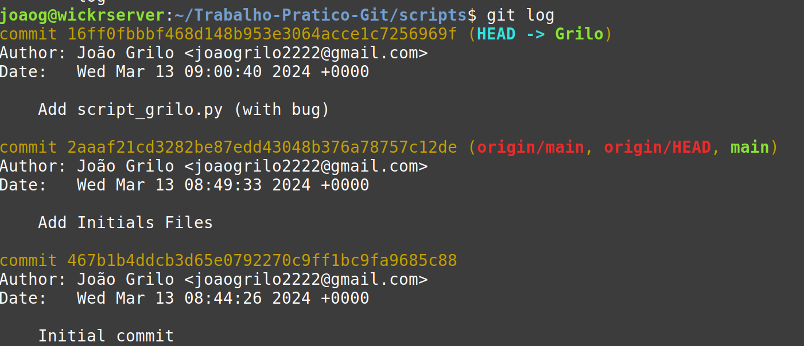
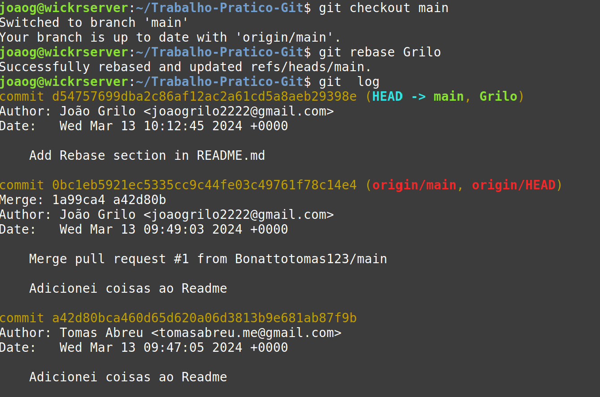
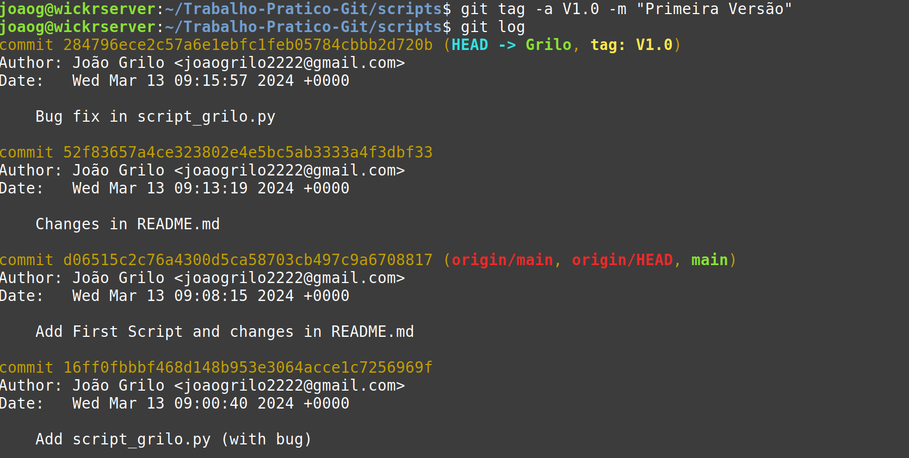
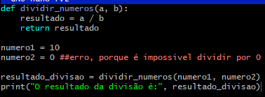
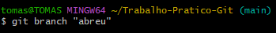

# Trabalho-Pratico-Git
Trabalho final prático de GIT

## Grilo

Incialmente Configurei o token para o projeto.
Depois adicionei as pastas principais do projeto e fiz commit para o github para a branch "main".

Criei a branch "Grilo" onde irei fazer as minhas alterações.

### Merge

Começei por criar um script chamado  "script_grilo.py" que é um script para calcular a area de um triangulo.

Depois fiz git commit de todas as alterações e irei realizar o git merge para juntar a branch "Grilo" para o "main".
De seguida fiz o push para o github para a branch "main" 

### Rebase
Entrei na branch Grilo fiz as alterações ao README.md.

Primeiro fiz um commit onde alterei o README.md, depois voltei a branch main e fiz o rebase.
Basicamente o rebase server para fazer com que os commits "pareçam que venham da branch main" e não da branch Grilo

### Cherry-pick e Tags

Primeiro fiz um commit onde alterei o README.md e depois fiz outro commit onde corrigi o bug do "script_grilo.py"

Adicionei tambem uma tag ao commit onde corri o bug onde meti "tag 1.0"

Depois voltei para a branch main e fiz cherry-pick apenas do commit "Bug fix in script_grilo.py" 

## Abreu

Inicialmente criei um script em python em que o erro se situa na linha 6 em que o numero2 está registado como 0, sendo impossivel a divisão.

De seguida criei uma branch, nomeadamente "branch_abreu" onde vou começar a trabalhar.

## Antunes

Bom dia, sou o Antunes. Comecei por fazer fork, de seguida criei um ficheiro python "hello world" com erros para corrigir dentro da minha branch.

